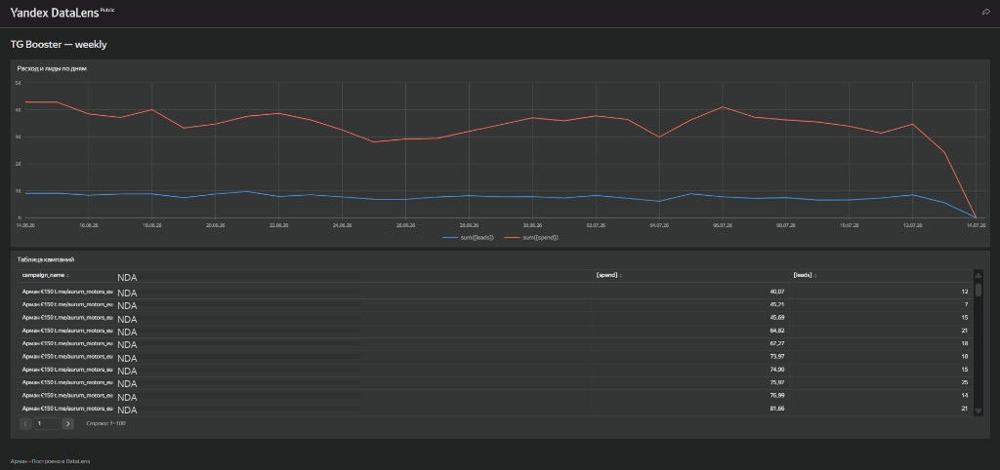

# Отчётность Telegram Ads → PostgreSQL → DataLens

Еженедельная сводка по расходу, лидам и CPL — из API рекламного кабинета в базу и дашборд.

> **Источник данных:** API TG Booster — панель, через которую ведётся Telegram Ads на проектах.

**Кейс на сайте:** [portfolio · one-pager](https://portfolio-beige-rho-600e1pt1yo.vercel.app/cases/etl-tg-booster)

## Результат

| | |
|--|--|
| **Строк в базе** | 863 за 14.06–14.07.2026 |
| **Охват** | 2 кабинета · 30 кампаний |
| **Расход / лиды** | 105 472,98 ₽ · 23 422 |
| **Сверка с ручной выгрузкой** | расхождение **< 0,04%** за 7 дней ([методика](docs/reconciliation.md)) |



## Задача

Каждую неделю статистика Telegram Ads собиралась вручную — выгрузка из кабинета, Excel, сводные. Нужен один источник с историей, дашборд и проверка, что цифры в базе совпадают с тем, что раньше сводил руками.

---

## Для разработчиков

### Архитектура

```
API рекламного кабинета  →  Python (extract, validate, load)  →  PostgreSQL  →  Yandex DataLens
```

| Слой | Объект | Назначение |
|------|--------|------------|
| Raw | `raw_campaign_stats` | Статистика кампаний, сырой JSON в `source_payload` |
| Mart | `mart_campaign_daily` | Представление для BI: CPL, CPC, CPM |
| Meta | `etl_runs` | Журнал запусков |

**Гранулярность:** день × кампания × кабинет.  
**Метрики:** расход, показы, клики, лиды.

### Стек

Python 3.11 · httpx · Pydantic · Typer · PostgreSQL 16 · Docker · Yandex DataLens

### Быстрый старт

#### 1. Окружение

```bash
python -m venv .venv
# Windows
.venv\Scripts\activate
# Linux / macOS
source .venv/bin/activate

pip install -e ".[dev]"
```

#### 2. Конфигурация

```bash
cp .env.example .env
```

Заполните `TG_BOOSTER_API_TOKEN` и `DATABASE_URL` (см. `.env.example`).

#### 3. PostgreSQL

```bash
docker compose up -d
python -m etl validate-config
```

Production PostgreSQL на VPS — [`docs/production-postgres.md`](docs/production-postgres.md) *(MVP-инфра, не hardened setup)*.

#### 4. Загрузка данных

```bash
# Первичная загрузка
python -m etl run --from 2026-06-01 --to 2026-06-30

# Инкремент (последние 7 дней)
python -m etl run --incremental
```

### CLI

| Команда | Описание |
|---------|----------|
| `validate-config` | Проверка `.env` и подключения к БД |
| `run --from DATE --to DATE` | Загрузка за период |
| `run --incremental` | Инкрементальная догрузка |
| `extract --dry-run` | Извлечение без записи в БД |
| `reconcile --from DATE --to DATE` | Дневные итоги для сверки |

Коды выхода: `0` — успех · `1` — конфигурация/валидация · `2` — ошибка API · `3` — пустой ответ.

### Сверка с ручной выгрузкой

[`docs/reconciliation.md`](docs/reconciliation.md) — пример за 7 дней, расхождение 0,025–0,036%.  
Небольшая разница нормальна: Excel детальнее (объявления), база — по кампаниям, плюс округление.

### Документация

| Файл | Содержание |
|------|------------|
| [`docs/datalens-setup.md`](docs/datalens-setup.md) | Подключение DataLens к PostgreSQL |
| [`docs/production-postgres.md`](docs/production-postgres.md) | PostgreSQL на VPS |
| [`docs/schedule.md`](docs/schedule.md) | Планировщик (cron / Windows) |
| [`docs/sql-queries.md`](docs/sql-queries.md) | SQL для еженедельного отчёта |

### Тесты

```bash
pytest
```

### Структура проекта

```
etl/           # извлечение, валидация, загрузка, CLI
sql/           # DDL, миграции, представления
docs/          # инструкции
scripts/       # скрипты автоматизации
tests/
```
